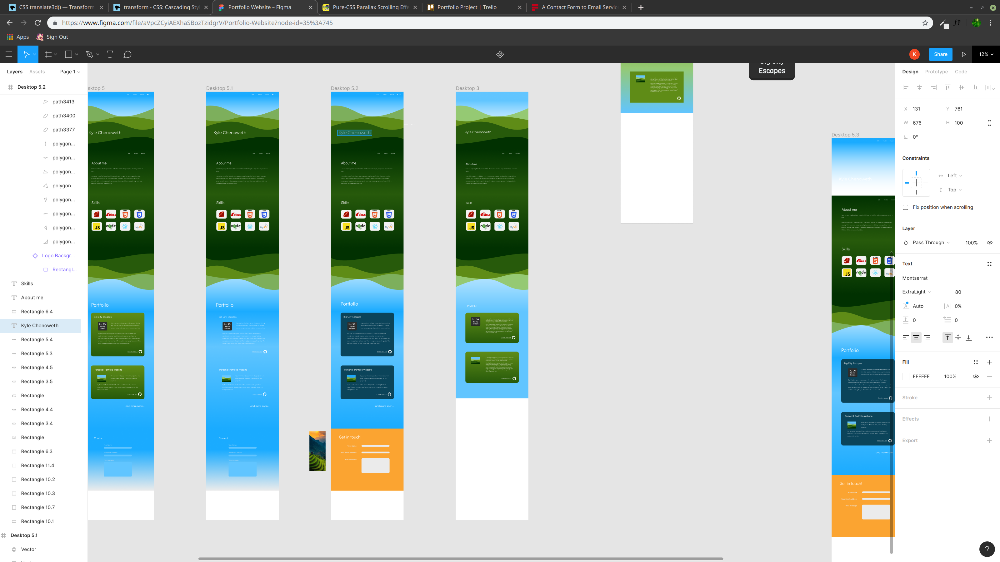

# Personal Portfolio - Kyle Chenoweth

Website URL - [https://agitated-wing-920288.netlify.com](https://agitated-wing-920288.netlify.com)

Github Repository - [https://github.com/PushBtnsDev/portfolio](https://github.com/PushBtnsDev/portfolio)
## Description

#### Purpose -
To design a personal portfolio website to display an overview of previous projects and skills.

#### Functionality/Features -
Internal and external links for easy site navigation and to learn more about the author.

#### Target Audience -
A member of a hiring team or a developer wishing to learn more about the author and inquire into previous project experience. 

#### Tech Stack -
Pure HTML and CSS was used for the site itself and deployment was handled by netlify.com

## Design and Planning

### Brainstorming

From the beginning I wanted the end product to have somewhat of a personal link to myself or reflect my personality in a way. To do this I searched using pinterest for images that resonated with me to begin to form a picture of how the site would look. I wanted to spend a fair amount of time on this stage and the design / mock-up phase as a strong preparation would save myself time in the long run. 

From this I noticed a theme of a natural rolling hills aesthetic as it reminded me of home. This coupled with an interest in both iconography and minimalism left me with a better idea for design and a solid foundation for the 'feel' of the site.

### Design

After seeing what I was drawn to on the image boards of pinterest I also began to think of a feature that might bring some life into my final design. Unfortunately this feature was not complete in time but gave me promise of future enhancements for the site.

The overall layout was made using figma and most of the process was spent in this stage. 

Trello was used for documenting the process and keeping tabs on the remaining tasks needed for completion.

## Q/A Answers -
- Describe key events in the development of the internet from the 1980s to today (max. 150 words)

In 1988 computers where all over the USA with 45 million PCs however the internet as we know it today was not concieved until in 1990 Tim Berners-Lee proposed a 'hypertext' system which formed the basis for the World Wide Web. Launced to the public on August 6 1991, the World Wide Web began it's network.

- Define and describes the relationship between fundamental aspects of the internet such as: domains, web servers, DNS, and web browsers (max. 150 words)

The process starts with the user accessing a document often written with HTML & CSS with the help of the web browser. The process is aimed at reaching a large audience for usability. The web browser converts simple domain names that users can easily understand into an IP address via the Domain Name System (DNS). This system can track the address needed to visit on the network. 

- Reflect on one aspect of the development of internet technologies and how it has contributed to the world today (max. 150 words)

Internet technologies has been one of, if not the most impactful event on the new century. It has enabled incredible leaps of communication between previously near impossible distances. This has allowed the information age to connect citizens and provide discussions of the world at large where previously a physical congregation would have been necessary. Not only a source of entertainment but also a source of great knowledge where information is at the tip of a finger. Without the internet the world would still run, albeit much slower. 