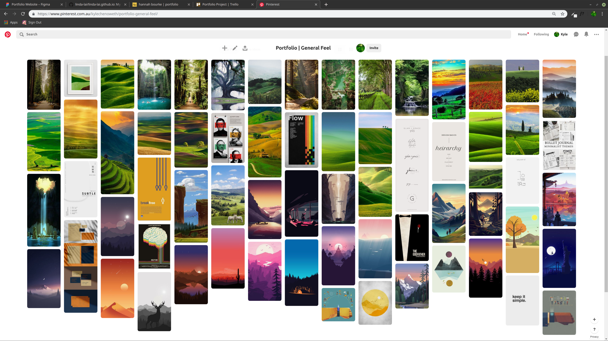
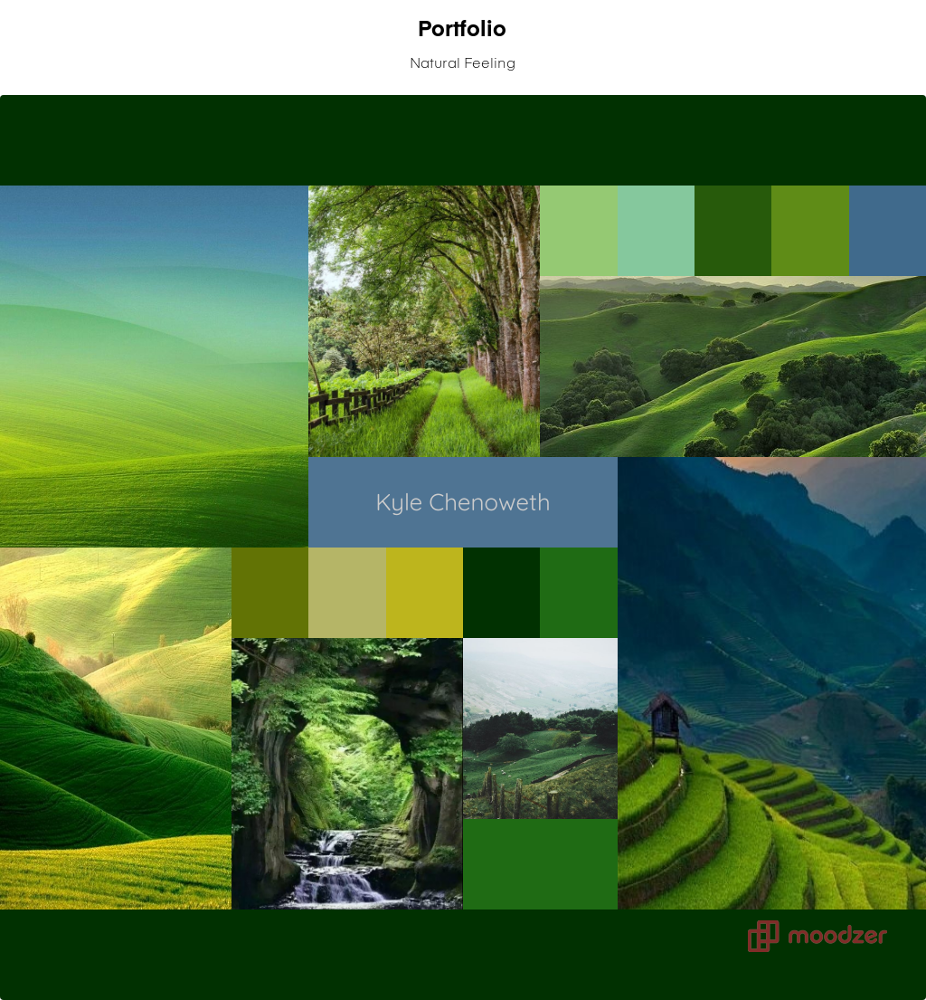

# Personal Portfolio - Kyle Chenoweth

## Design and Planning

### Brainstorming

From the beginning I wanted the end product to have somewhat of a personal link to myself or reflect my personality in a way. To do this I searched using pinterest for images that resonated with me to begin to form a picture of how the site would look. I wanted to spend a fair amount of time on this stage and the design / mock-up phase as a strong preparation would save myself time in the long run. 

From this I noticed a theme of a natural rolling hills aesthetic as it reminded me of home. This coupled with an interest in both iconography and minimalism left me with a better idea for design and a solid foundation for the 'feel' of the site.

After seeing what I was drawn to on the image boards of pinterest I also began to think of a feature that might bring some life into my final design. 